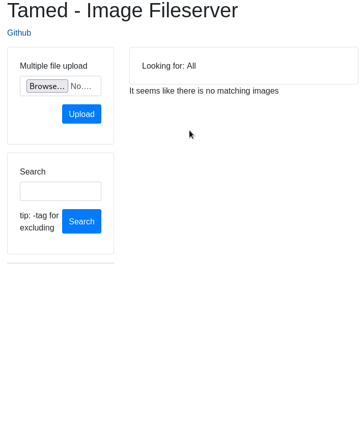

# Tamed - Image Fileserver

## features

- PostgreSQL post store using [uptrace/bun](https://github.com/uptrace/bun)
- REST api using [gin-gonic/gin](https://github.com/gin-gonic/gin)
- Web client using [svelte](https://github.com/sveltejs/svelte)
- Deployed to heroku [https://pgeowng-tamed.herokuapp.com/](https://pgeowng-tamed.herokuapp.com/)

## todo

- Uploading video/audio formats
- Generating preview media

## quick preview

